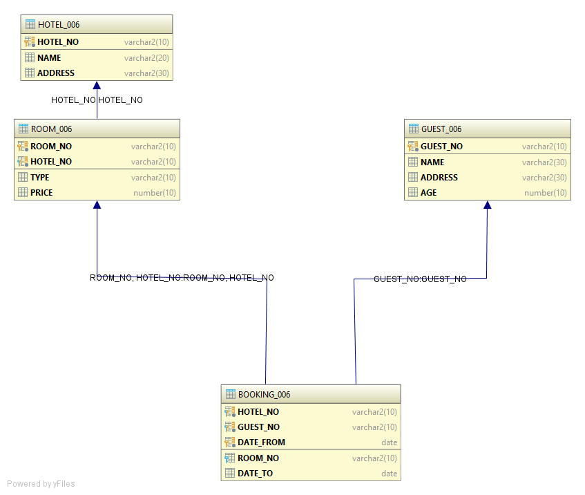
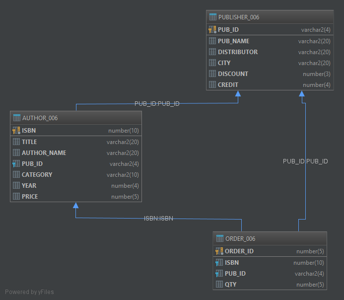

# Database Management System Lab
### IT691

### Assignment 1

- Use of Data Definition Language to create and drop tables.

### Assignment 2
- Use of **SELECT** to get answers.

### Assignment 3
- GROUP BY
- SUBQUERY & JOIN
- ORDER BY
- DML

### Assignment 4
- ORDER BY
- PATTERN MATCHING
- IN AND NOT IN
- RANGE SEARCHING

### Assignment 5
- CHECK CONSTRAINT
- TO_CHAR
- SUBQUERY

### Assignment 6

- CREATE THE TABLES AS PER THE SCHEMA WITH CHECK CONSTRAINTS
- INSERT DATA INTO TABLES

### Assignment 7
- CONCEPT OF VIEWS
