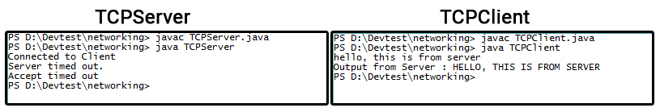

<h1 align="center">Assignment 3</h1>
<h2 align="center">Simple TCP Server and Client using Java</h2>

### Aim : IMPLEMENTATION OF ECHO SERVER SOCKET USING TCP/IP

### Abstract
- **TCP/IP** : TCP/IP (Transmission Control Protocol/Internet Protocol) is the basic communication protocool of the internet. It can also be used as a communication protocol in a private network. TCP/IP is a two layer program. The higher layer, TCP, manages the assembling of a message or file into smaller packets that are transmitted over the internet and received by a TCP layer that reassembles the packets into the original message. The lower layer IP, handles the address part of each packet so that it gets to the right destination. Each gateway computer on the network checks this address to see where to forward the message.
- **ECHO Server** : An echo server is usually an application which is used to test if the connection between a client and a server is successful. It consists of a server which sends back whatever text the client sent.
Our goal is to create an echo server which recieves the text from the client, capitalizes it and then sends it back to the client.

### Algorithm
1. Create two programs, one for server side (TCPServer.java) and another for client side (TCPClient.java).
2. In the server side, create a server socket.
3. Create a socket and accept the connection of client.
4. Create the object of **`DataInputStream`** or **`BufferedReader`** to accept input from client.
5. Display the input received from the client.
6. In the client side, create a socket to connect to the server.
7. Create the object of **`BufferedReader`** to accept **`inFromServer`**.
8. Create the object of **`DataOutputStream`** to send data to server.
9. Display the input received from the server.
10. Close the socket connection.

### TCP Server

```java
import java.io.*;
import java.net.*;

class TCPServer {
	public static void main(String args[]) throws IOException {
		String clientSentence ;
		String capitalizedSentence;
		ServerSocket ws = new ServerSocket(1234);
		ws.setSoTimeout(15000); // Setting the timeout time to 15 seconds.

		boolean connection = true; // Connection flag.

		while(connection)
		{
			try {
				Socket cs = ws.accept();
				System.out.println("Connected to Client"); // Log if connected.
				BufferedReader inFromClient = new BufferedReader(new InputStreamReader(cs.getInputStream()));
				DataOutputStream outToClient = new DataOutputStream(cs.getOutputStream());
				clientSentence = inFromClient.readLine();
				capitalizedSentence = clientSentence.toUpperCase() + "\n";
				outToClient.writeBytes(capitalizedSentence);
				/*
				// Logging if the last line is actually executing
				// in case of a fault.
				System.out.println("Msg sent");
				*/
			} catch (SocketTimeoutException e) {
				System.err.println("Server timed out." + "\n" + e.getMessage());
				connection = false;
			}
		}
	}
}
```

### TCP Client

```java
import java.io.*;
import java.net.*;

class TCPClient {
	public static void main(String args[]) throws IOException {
		String sentence;
		String modifiedSentence;
		BufferedReader inFromUser = new BufferedReader(new InputStreamReader(System.in));
		try {
			Socket cs = new Socket("localhost",1234); // This can throw exceptions
			DataOutputStream outToServer = new DataOutputStream(cs.getOutputStream());
			BufferedReader inFromServer = new BufferedReader(new InputStreamReader(cs.getInputStream()));
			sentence = inFromUser.readLine();
			outToServer.writeBytes(sentence + '\n');
			modifiedSentence = inFromServer.readLine();
			System.out.println("Output from Server : " + modifiedSentence);
			cs.close();
		} catch (ConnectException e) {
			System.err.println("Exception:" + "\n" + e.getMessage());
		}
	}
}
```
### Output

