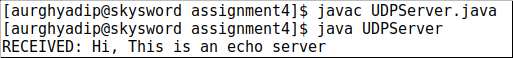
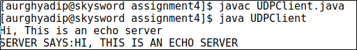

## Assignment 4

### Simple UDP Server and Client using Java

#### AIM : IMPLEMENTATION OF UDP ECHO SERVER AND CLIENT
#### Abstract
**UDP**: The User Datagram Protocol is the simpler of the two standards TCP/IP transport protocols. It is an end-to-end transport level protocol that adds only port addresses, checksum errors control, and length information to the data from the upper layer. The packet produced by the UDP is called a user datagram.

**Difference Between TCP and UDP:**

|                  Topic                   | TCP                                      | UDP                                      |
| :--------------------------------------: | :--------------------------------------- | :--------------------------------------- |
|             **Definitions**              | TCP (Transmission Control Protocol) is a connection oriented stream over an IP network. It guarantees that all sent packets will reach the destination in the correct order. This imply the use of acknowledgement packets sent back to the sender, and automatic retransmission, causing additional delays and a general less efficient transmission than UDP. | UDP (User Datagram Protocol) is a connection-less protocol. Communication is datagram oriented. The integrity is guaranteed only on the single datagram. Datagrams reach destination and can arrive out of order or don't arrive at all. It is more efficient than TCP because it uses non ACK. It's generally used for real time communication, where a little percentage of packet loss rate is preferable to the overhead of a TCP connection. |
|               **Function**               | As a message makes its way accross the internet from one computer to another. This is connection Based | UDP is also a protocol used in message transport or transfer. This is not connection based which means that one program can send a load of packets to another and that would be the end of the relationship. |
|                **Usage**                 | TCP is suited for applications that require high reliability, and transmission time is relatively less critical. | UDP is suitable for applications that need fast, efficient transmission, such as games. UDP's stateless nature is also useful for servers that answer small queries from huge number of clients. |
|               **Used By**                | HTTP, HTTPS, FTP, SMTP, Telnet           | DNS, DHCP, TFTP, SMNP, RIP, VOIP         |
|       **Ordering of Data Packets**       | TCP rearranges data packets in the order specified. | UDP has no inherent order as all packets are independent of each other. If ordering is required, it has to be managed by application layer. |
|          **Speed of Transfer**           | The speed for TCP is slower than UDP     | UDP is faster because error recovery is not attempted. It is a "best effort" protocol. |
|             **Reliability**              | There is absolute guarantee that the data transferred remains intact and arrives in the same order in which it was sent. | There is no guarantee that the messages or packets sent would reach at all. |
|             **Header Size**              | TCP header size is 20 bytes.             | UDP Header size is 8 bytes.              |
|          **Streaming of Data**           | Data is read as a byte stream, no distinguishing indications are transmitted to signal message bounderies. | Packets are sent individually and are checked for integrity only if they arrive. |
|                **Weight**                | TCP is heavyweight. It requires three packets to set up a socket connection, before any user data can be sent. | UDP is lightweight. There is no ordering of messages, no tracking connections, etc. It is small transport layer designed on top of IP. |
| **Data Flow Control and Error Checking** | TCP handles reliability and congestion control. Also TCP Does error checking and error recovery. | UDP does not have an option for flow control. UDP does error checking but simply discards erroneous packets. Error recovery is not attempted. |
|           **Acknowledgement**            | Yes, segments.                           | No                                       |


**ECHO Server** : An echo server is usually an application which is used to test if the connection between a client and a server is successful. It consists of a server which sends back whatever text the client sent.
Our goal is to create an echo server which receives the text from the client, capitalizes it and then sends it back to the client.

### Algorithm
1. Create two programs, one for the server side (UDPServer.java) and another for the client side (UDPClient.java).
2. Create an instance of `DatagramSocket` & `DatagramPacket` in the server side.
3. Receive the packet from the client using `DatagramSocket`'s `receive` method.
4. Get data from `DatagramSocket` using `getData()` and print it.
5. Get the message using `getBytes()`.
6. Send the packet to the client using `send()` method of `DatagramSocket`.
7. Create instances of `DatagramSocket` and `DatagramPacket` in client side.
8. Take keyboard input from user in the client side using `BufferedReader`.
9. Send the message to the server using `send()` of `DatagramPacket`.
10. Receive message from server using `DatagramSocket`'s `receive()` method.
11. Print the message in the client side.
12. Close the connection using `close()` method of `DatagramSocket`.

### UDP Server

```java
import java.io.*;
import java.net.*;

class UDPServer {
   public static void main(String args[]) throws IOException {

      DatagramSocket serverSocket = new DatagramSocket(9876);
      byte[] receiveData = new byte[1024];
      byte[] sendData = new byte[1024];

      while(true) {
         DatagramPacket receivePacket = new DatagramPacket(receiveData, receiveData.length);
         serverSocket.receive(receivePacket);
         String sentence = new String(receivePacket.getData());
         System.out.println("RECEIVED: " + sentence);
         InetAddress IPAddress = receivePacket.getAddress();
         int port = receivePacket.getPort();
         String capitalizedSentence = sentence.toUpperCase();
         sendData = capitalizedSentence.getBytes();
         DatagramPacket sendPacket = new DatagramPacket(sendData, sendData.length, IPAddress, port);
         serverSocket.send(sendPacket);
      }
   }
}
```

### UDP Client

```java
import java.io.*;
import java.net.*;

class UDPClient {
   public static void main(String args[]) throws Exception {

      BufferedReader inFromUser = new BufferedReader(new InputStreamReader(System.in));
      DatagramSocket clientSocket = new DatagramSocket();
      InetAddress IPAddress = InetAddress.getByName("localhost");
      byte[] sendData = new byte[1024];
      byte[] receiveData = new byte[1024];

      String sentence = inFromUser.readLine();
      sendData = sentence.getBytes();
      DatagramPacket sendPacket = new DatagramPacket(sendData, sendData.length, IPAddress, 9876);

      clientSocket.send(sendPacket);
      DatagramPacket receivePacket = new DatagramPacket(receiveData, receiveData.length);

      clientSocket.receive(receivePacket);
      String modifiedSentence = new String(receivePacket.getData());

      System.out.println("SERVER SAYS:" + modifiedSentence);

      clientSocket.close();
   }
}
```
### Output
| UDP SERVER                              | UDP CLIENT                              |
| --------------------------------------- | --------------------------------------- |
|  |  |
