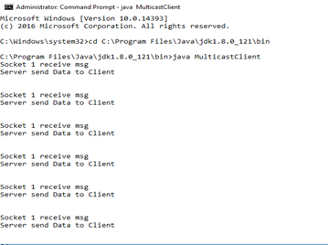

# Assignment 5

## Multicast Server using UDP Protocol using Java

## AIM: To implement a Multicast Server using UDP Protocol.

**THEORY:** The User Datagram Protocol (UDP) is simplest Transport Layer communication protocol of the TCP/IP Protocol suite. It involves minimum amount of communication mechanism. UDP is said to be an unreliable transport protocol but it uses IP services which provides best effort delivery mechanism.
In UDP, the receiver does not generate an acknowledgement of packet received and in turn, the sender does not wait for any acknowledgement of packet sent. This shortcoming makes this protocol unreliable as well as easier on processing.

**IP address classes:**
With an IPv4 IP address, there are five classes of available IP ranges: Class A, Class B, Class C, Class D and Class E, while only A, B, and C are commonly used. Each class allows for a range of valid IP addresses, shown in the following table.

| CLASS   | ADDRESS RANGE                    | Supports                                 |
| ------- | -------------------------------- | ---------------------------------------- |
| CLASS A | `1.0.0.1` to `126.255.255.254`   | Supports 16 million hosts on each of 127 networks. |
| CLASS B | `128.1.0.1` to `191.255.255.254` | Supports 65,000 hosts on each of 16,000 networks. |
| CLASS C | `192.0.1.1` to `223.255.254.254` | Supports 254 hosts on each of 2 million networks. |
| CLASS D | `224.0.0.0` to `239.255.255.255` | Reserved for multicast groups.           |
| CLASS E | `240.0.0.0` to `254.255.255.254` | Reserved for future use, or Research and Development Purposes. |

Ranges 127.x.x.x are reserved for the loopback or localhost, for
example, 127.0.0.1 is the loopback address. Range 255.255.255.255 broadcasts to all hosts on the local network.

To understand Multicast, we should first know what is Unicast and Broadcast.
**Unicast:** Unicast is the term used to describe communication where a piece of information is sent from one point to another point. In this case there is just one sender, and one receiver.
Unicast transmission, in which a packet is sent from a single source to a specified destination, is still the predominant form of transmission on LANs and within the Internet. All LANs and IP networks support the unicast transfer mode, and most users are familiar with the standard unicast applications (e.g. http, smtp, ftp and telnet) which employ the TCP transport protocol.

**Broadcast:** Broadcast is the term used to describe communication where a piece of information is sent from one point to all other points. In this case there is just one sender, but the information is sent to all connected receivers.
Broadcast transmission is supported on most LANs and may be used to send the same message to all computers on the LAN (e.g. the address resolution protocol (arp) uses this to send an address resolution query to all computers on a LAN). Network layer protocols (such as IPv4) also support a form of broadcast that allows the same packet to be sent to every system in a logical network (in IPv4 this consists of the IP network ID and an all 1's host number).

**Multicast:** Multicast is the term used to describe communication where a piece of information is sent from one or more points to a set of other points. In this case there is may be one or more senders, and the information is distributed to a set of receivers (there may be no receivers, or any other number of receivers).
One example of an application which may use multicast is a video server sending out networked TV channels. Simultaneous delivery of high quality video to each of a large number of delivery platforms will exhaust the capability of even a high bandwidth network with a powerful video clip server. This poses a major salability issue for applications which required sustained high bandwidth. One way to significantly ease scaling to larger groups of clients is to employ multicast networking.

Multicasting is the networking technique of delivering the same packet simultaneously to a group of clients. IP multicast provides dynamic many-to-many connectivity between a set of senders (at least 1) and a group of receivers. The format of IP multicast packets is identical to that of unicast packets and is distinguished only by the use of a special class of destination address (class D IPv4 address) which denotes a specific multicast group. Since TCP supports only the unicast mode, multicast applications must use the UDP transport protocol.
Unlike broadcast transmission, multicast clients receive a stream of packets only if they have previously elect to do so by joining the specific multicast group address. Membership of a group is dynamic and controlled by the receivers in turn informed by the local client applications. The routers in a multicast network learn which sub-networks have active clients for each multicast group and attempt to minimize the transmission of packets across parts of the network for which there are no active clients

**IP Multicast Address Ranges and Uses**

| RANGE START ADDRESS | RANGE END ADDRESS | DESCRIPTION                              |
| ------------------- | :---------------: | :--------------------------------------- |
| `224.0.0.0`         |   `224.0.0.255`   | Reserved for special “well-known” multicast addresses. |
| `224.0.1.0`         | `238.255.255.255` | Globally-scoped (Internet-wide) multicast addresses. |
| `239.0.0.0`         | `239.255.255.255` | Administratively-scoped (local) multicast addresses |

### ALGORITHM:

1. Create 2 programs, one for server(MulticastServer.java) another for client(MulticastClient.java)
2. In the Server side get the address in which we going to connect & create ServerSocket using DatagramPacket
3. Create DatagramPacket that will contain the data,data length,destination IP Address,Port Address and send in DatagramSocket Class.
4. In Client side,get the address where the server is going to send the data.
5. Create a MulticastSocket that will allow other socket to join as well.
6. Join to that Multicast group using join method,to receive the Packet using DatagramPacket Class pass on as data & data length.
7. Receive the message and print it.

### PROGRAMS:

**MulticastReceiver**
```java
import java.io.*;
import java.net.*;

class MulticastClient {

    final static String Inet_Addr="224.0.0.3";
    final static int Port=8888;

    public static void main(String args[]) throws UnknownHostException {

        InetAddress address=InetAddress.getByName(Inet_Addr);
        byte[]buf=new byte[256];

        try {
            MulticastSocket clientSocket=new MulticastSocket(Port);
            clientSocket.joinGroup(address);

            while(true) {
                DatagramPacket receivePacket=new DatagramPacket(buf,buf.length);
                clientSocket.receive(receivePacket);
                String msg=new String(buf,0,buf.length);
                System.out.println("Socket 1 receive msg"+msg);
                Thread.sleep(500);
            }
        } catch(Exception e){}
    }
}
```
<br><br><br>
**MulticastSender**
```java
import java.io.*;
import java.net.*;

class MulticastServer {
    
    final static String Multicastaddr="224.0.0.3";
    final static int Port=8888;
   
    public static void main(String args[]) throws UnknownHostException {
        
        InetAddress IPAddress = InetAddress.getByName(Multicastaddr);
        
        try {  
            DatagramSocket serversocket=new DatagramSocket();
            for(int i=0;i<=5;i++) {
                String msg="Server send Data to Client";
                DatagramPacket sendPacket=new DatagramPacket(msg.getBytes(),msg.getBytes().length,IPAddress,Port);
                serversocket.send(sendPacket);
                System.out.println("Server send Packet"+i);
                Thread.sleep(500);
            }
        } catch(Exception e){}
    }
}
```

**Output:**

**Multicast Server:**


**Multicast Clients:**

| Client 1                           | Client 2                           |
| ---------------------------------- | ---------------------------------- |
|  |  |

**Conclusion:** From this experiment we get to what Multicast is, and what are their ranges and applications. We also get to know the classifications of IP Address.